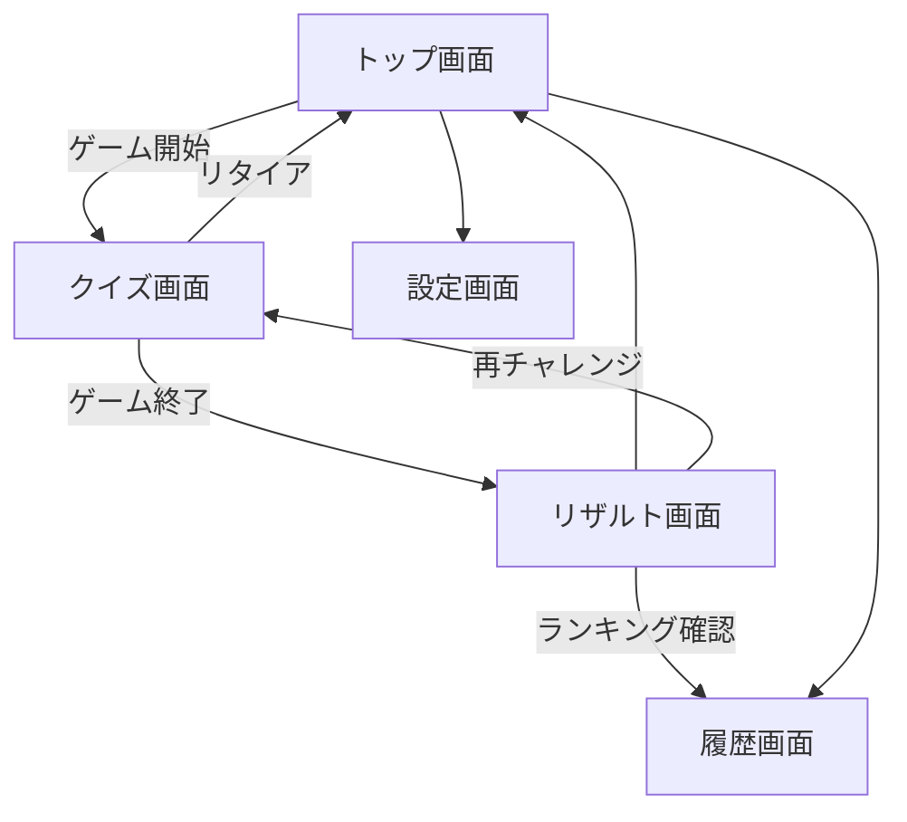
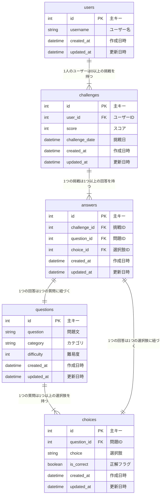
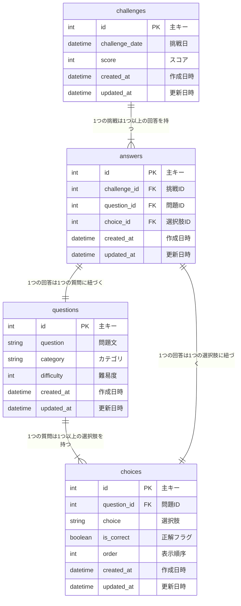

# 開発順序（例）

４択クイズアプリを例に開発順序の例を示します。
ここでは、設計と実装について言及します。

# 1. 要件の確認
- 4択のクイズに回答するアプリ
- 1問当たり10秒のカウントダウンがある（カウント切れたら次の問題に進む）
- 回答ボタンがあり、ボタンを押すと正解不正解がわかる(効果音を鳴らす）
- 10問１セットで問題を解き終わったときにリザルト画面が表示される・結果は共有できる
- 過去のリザルトを一覧で見ることができる（得点順・回答日順にソートできる）
- クイズは１０問以上用意し毎回ランダムで出題する（選択肢もシャッフルする)

# 2. 画面遷移図と画面ごとの機能
## 2.1 画面遷移図


## 2.2 画面ごとの機能
- トップ画面
  - クイズ画面への遷移ボタン
  - 履歴画面への遷移ボタン
  - 設定画面への遷移ボタン
- クイズ画面
  - 問題文と選択肢
    - １問ずつボタンを押したら進む（全10問）
    - 選択肢を押すと正誤と効果音
  - リタイアボタン
    - 確認ダイアログ→トップ画面へ
- リザルト画面
  - クイズのスコア表示
  - 再チャレンジボタン
    - クイズ画面へ
- 履歴画面
  - 過去のクイズの回答結果を表示
    - 得点順・回答日順にソート
- 設定画面
  - 言語設定
  - テーマ設定
  - ライセンス画面

# 3. DB設計
今回はクイズの問題と正解、その選択肢、回答結果を保存するためのテーブルを作成します。

## RDBの場合
- userログインを実装するとき


---

- ユーザーログインを実装しない時


- FirebaseのNoSQLを使う場合は以下のようなパス設計になりそう
firebaseの場合ユーザーを作らないのは結構意味不明なのでuserがいる前提
```
users/
└── {user_id}/
    ├── username: string
    ├── email: string
    └── challenges/
        └── {challenge_id}/
            ├── date: timestamp
            ├── score: number
            └── answers/
                └── {answer_id}/
                    ├── questionId: string
                    └── choiceId: string
questions/
└── {question_id}/
    ├── question: string
    ├── category: string
    ├── difficulty: number
    └── choices/
        └── {choice_id}/
            ├── text: string
            ├── isCorrect: boolean
            └── order: number

```

# 4. 技術選定
今回はローカルDBを使う場合を想定する(userなし)
- 言語：dart
- フレームワーク：Flutter
- DB：sqlite(sqfliteパッケージを使用)
- 状態管理：Riverpod, flutter_hooks

# 5. 実装
実装タスクを洗い出す

## 5.1 データモデルの作成
- challengeモデル
- questionモデル
- choicesモデル
- answersモデル

## 5.2 DBの初期化
- DBの初期化処理を書く
  - 初期化タイミングの検討
    - 毎回初期化しているとデータが消えるので、初回のみ初期化するようにする
- テーブルの作成
- データの初期投入
  - 問題文はseedとして入れておく
- CRUD処理の実装
  - データの取得
  - データの追加
  - データの更新
  - データの削除

## 5.3 画面の作成
- 画面遷移図に基づいて画面を作成
  - トップ画面
  - クイズ画面
  - リザルト画面
  - 履歴画面
  - 設定画面

## 5.4 ロジックの実装
- クイズ画面のロジック
  - 問題文の取得
  - 選択肢の取得
  - 正解の取得
  - 回答の保存
  - スコアの計算
  - カウントダウンの実装
  - 効果音の再生
- リザルト画面のロジック
  - スコアの表示
  - ランキングの表示
- 履歴画面のロジック
  - 履歴の取得
  - ソート機能の実装
- 設定画面のロジック
  - 言語設定
  - テーマ設定
  - ライセンス画面
